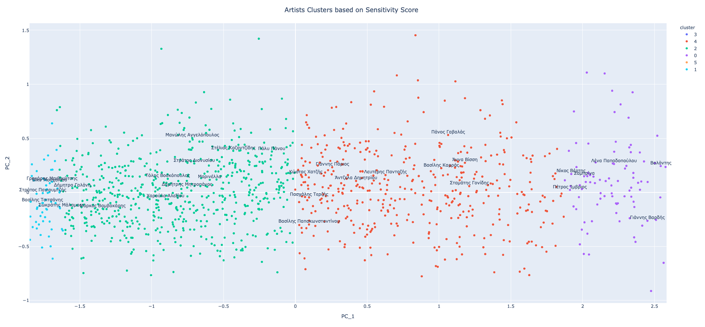

### Web Scrapper for stixoi.info

This is a web scrapper for stixoi.info page where information related to greek songs are to be found. 

Information like artist names, lyricists and composers as well as lyrics of songs in greek language are fetched and can be used for other projects.

```
conda create -n sinfo python=3.10 -y
conda activate sinfo
pip install -r requirements.txt
```

Scripts included are fetching processing and storing the files in an SQLite Database in your local folder. You can use the following to scrap data and build the database:

```
python src/main.py
```

Data will be stored in stixoi_info.db. In all scripts 'time.sleep' parameters have been set to avoid server overload, therefore running the script will take some hours. 

**After creating the database** you can play around with the data, for example you can cluster the artists based on the songs 
that they first sang.In this case I have used the songs and built a sensitivity score based on a sentitivity dictionary on greek language. To do this run the following:

```
python src/artist_clustering.py
```

As seen below, (screenshot of plot which is included as html file in the repo) artists that represent different genres are clustered together. 


